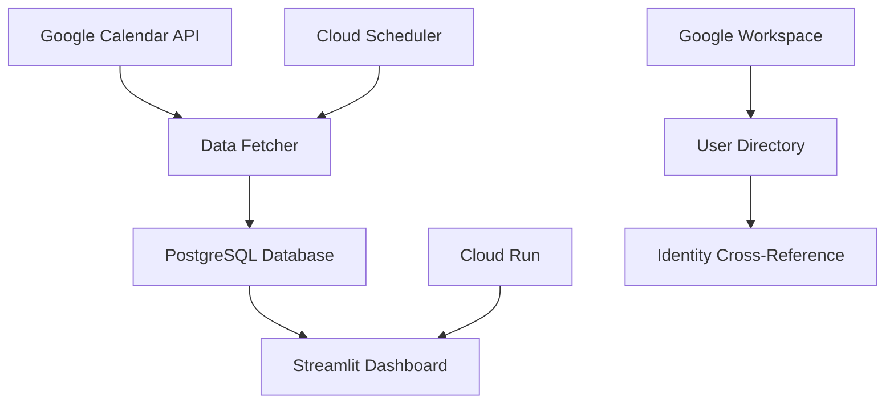

# 📅 Calendar Insights

[](https://github.com/your-org/calendar-insights)
[](https://docker.com)
[](https://cloud.google.com/run)

> Transform your Google Calendar data into actionable meeting insights with beautiful analytics dashboards.

## ✨ Features

🔍 **Meeting Analytics** - Daily, weekly, monthly trends and patterns  
👥 **Participant Insights** - Department and team collaboration analysis  
📊 **Interactive Dashboard** - Filter by time, departments, meeting types  
🤖 **AI Chat Assistant** - Ask questions about your meeting data in natural language  
📈 **Export Reports** - CSV downloads and visual report generation  
⚡ **Real-time Updates** - Automated data fetching and synchronization  
🔒 **Enterprise Security** - OAuth2 integration with Google Workspace  

## 🚀 Quick Deploy

### Option 1: Easy Setup (Recommended)
```bash
git clone git@github.com:AZNH7/calendar-insights.git
cd calendar-insights/app-gcp
./deploy.sh
```
Follow the interactive setup guide!

### Option 2: Manual Cloud Deployment
```bash
git clone git@github.com:AZNH7/calendar-insights.git
cd calendar-insights/app-gcp
./scripts/cloud-deploy.sh
```
Access at: `https://your-service-url.run.app`

📖 **Need help?** Check out our [Complete Setup Guide](SETUP_GUIDE.md), [Security Guide](SECURITY.md), or [CI/CD Guide](CI_CD_GUIDE.md)


## 🎯 Deployment Options

| Method | Best For | Setup Time | Scalability | Platform |
|--------|----------|------------|-------------|----------|
| **GitHub Actions** | Teams, automation | 5 min | Auto-scaling | GCP |
| **Local Docker** | Development, testing | 2 min | Single instance | Local |
| **Manual GCP** | Production, control | 10 min | Full cloud | GCP |


### GitHub Actions (Automated)
1. Go to **Actions** → **Run workflow**
2. Choose your options:
   - ✅ Deploy cloud app (`app-gcp/`)
   - ⚠️ Deploy self-hosted app (`app/`) - **TBD: Under Development**
   - 🎯 Select environment (prod/dev/staging)
3. Click **Run workflow**

**Results:**
- Cloud app → Auto-deployed to Google Cloud Run
- Self-hosted app → **TBD** - Currently under development

### Manual Commands
```bash
# Cloud deployment
cd app-gcp && ./deploy.sh cloud

# Local development
cd app-gcp && ./deploy.sh local

# AI setup only
cd app-gcp && ./deploy.sh ai
```

## ⚙️ Configuration

### Prerequisites
- Google Cloud Platform account (for app-gcp)
- Google Workspace admin access
- Docker installed

### Required Secrets
Set these in your deployment method:
- `GCP_SERVICE_ACCOUNT_KEY` - Google Cloud credentials
- `POSTGRES_PASSWORD` - Database password (⚠️ **NO DEFAULT** - must be set)
- `GOOGLE_API_KEY` - Google AI API key (for AI Chat Assistant)
- `GOOGLE_CLIENT_SECRET` - OAuth client secret
- `SECRET_KEY` - Application security key

🔒 **Security Note**: Never use default passwords in production! See [SECURITY.md](SECURITY.md) for best practices.

### Google Calendar Setup
1. Enable Google Calendar API in [Google Cloud Console](https://console.cloud.google.com)
2. Create OAuth2 credentials
3. Add authorized redirect URIs
4. Download credentials to `app-gcp/credentials/`

## 🏗️ Architecture



**Components:**
- **Cloud App** (`app-gcp/`) - Production-ready, serverless, auto-scaling on GCP

## 📊 Application Comparison

### ☁️ Cloud App (`app-gcp/`) - GCP Serverless
- **Platform**: Google Cloud Run + Cloud SQL
- **Scaling**: Automatic serverless scaling
- **Database**: Cloud SQL PostgreSQL
- **Best For**: Quick deployment, cloud-native teams
- **Features**: 
  - Streamlined calendar analytics
  - AI Chat Assistant for natural language queries
  - Automated daily data fetching
  - Cloud Scheduler integration
  - Secret Manager security


## 🤖 AI Chat Assistant

Ask intelligent questions about your meeting data using natural language powered by Google's Agent Development Kit (ADK) and Gemini models.

### ✨ Features
- **🧠 Intelligent Analysis**: Meeting pattern recognition, efficiency assessment, organizational insights
- **💬 Natural Language Interface**: Ask questions in plain English with contextual responses
- **📊 Real-time Data Integration**: Works with your live calendar data
- **🔍 Comprehensive Metrics**: Access to all meeting data including attendance, duration, and efficiency scores

### 💡 Example Questions
- **"Which user has the most meetings?"**
- **"What are our meeting efficiency patterns?"**
- **"How many one-on-one meetings do we have?"**
- **"Which department has the most meetings?"**
- **"What trends do you see in our meeting data?"**
- **"What's our average meeting duration?"**

### 🚀 Quick Setup
1. Get a Google AI API key from [Google AI Studio](https://aistudio.google.com/app/apikey)
2. Set the `GOOGLE_API_KEY` environment variable
3. Deploy with AI Chat enabled
4. Click "🤖 AI Chat Assistant" in the dashboard

## 🛠️ Development

```bash
# Setup
python -m venv venv
source venv/bin/activate
pip install -r app-gcp/requirements.txt

# Run locally
cd app-gcp
streamlit run dashboard.py
```

## 🤝 Contributing

1. Fork the repository
2. Create a feature branch
3. Submit a pull request

## 📄 License

MIT License - see [LICENSE](LICENSE) file.

## 🆘 Support

- **Issues**: [GitHub Issues](../../issues)
