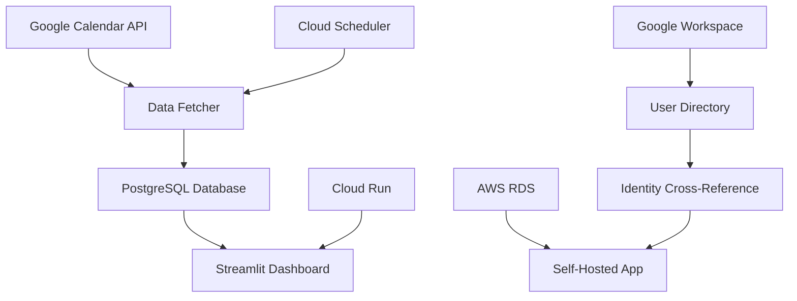

# 📅 Calendar Insights

[](https://github.com/your-org/calendar-insights)
[](https://docker.com)
[](https://cloud.google.com/run)

> Transform your Google Calendar data into actionable meeting insights with beautiful analytics dashboards.

## ✨ Features

🔍 **Meeting Analytics** - Daily, weekly, monthly trends and patterns  
👥 **Participant Insights** - Department and team collaboration analysis  
📊 **Interactive Dashboard** - Filter by time, departments, meeting types  
📈 **Export Reports** - CSV downloads and visual report generation  
⚡ **Real-time Updates** - Automated data fetching and synchronization  
🔒 **Enterprise Security** - OAuth2 integration with Google Workspace  

## 🚀 Quick Deploy

### Option 1: Cloud Deployment (Recommended)
```bash
git clone <repository-url>
cd calendar-insights/app-gcp
./deploy-with-options.sh
```
Access at: `https://your-service-url.run.app`

### Option 2: Self-Hosted/AWS Deployment (TBD)
```bash
# Currently under development - TBD
# git clone <repository-url>
# cd calendar-insights/app
# docker-compose up -d
```
Status: **To Be Determined** - Under active development

## 🎯 Deployment Options

| Method | Best For | Setup Time | Scalability | Platform |
|--------|----------|------------|-------------|----------|
| **GitHub Actions** | Teams, automation | 5 min | Auto-scaling | GCP |
| **Local Docker** | Development, testing | 2 min | Single instance | Local |
| **Manual GCP** | Production, control | 10 min | Full cloud | GCP |
| **AWS RDS** | Enterprise, hybrid | TBD | TBD | AWS (Under development) |

### GitHub Actions (Automated)
1. Go to **Actions** → **Run workflow**
2. Choose your options:
   - ✅ Deploy cloud app (`app-gcp/`)
   - ⚠️ Deploy self-hosted app (`app/`) - **TBD: Under Development**
   - 🎯 Select environment (prod/dev/staging)
3. Click **Run workflow**

**Results:**
- Cloud app → Auto-deployed to Google Cloud Run
- Self-hosted app → **TBD** - Currently under development

### Manual Commands
```bash
# Cloud deployment
cd app-gcp && ./deploy-with-options.sh

# Self-hosted deployment (TBD - Under Development)
# cd app && docker-compose up -d

# Development mode
cd app-gcp && streamlit run dashboard.py
```

## ⚙️ Configuration

### Prerequisites
- Google Cloud Platform account (for app-gcp)
- AWS account (for app/ with RDS)
- Google Workspace admin access
- Docker installed

### Required Secrets
Set these in your deployment method:
- `GCP_SERVICE_ACCOUNT_KEY` - Google Cloud credentials
- `POSTGRES_PASSWORD` - Database password
- `AWS_ACCESS_KEY_ID` - AWS credentials (for app/)
- `AWS_SECRET_ACCESS_KEY` - AWS secret key (for app/)

### Google Calendar Setup
1. Enable Google Calendar API in [Google Cloud Console](https://console.cloud.google.com)
2. Create OAuth2 credentials
3. Add authorized redirect URIs
4. Download credentials to `app-gcp/credentials/`

## 🏗️ Architecture



**Components:**
- **Cloud App** (`app-gcp/`) - Production-ready, serverless, auto-scaling on GCP
- **Self-Hosted App** (`app/`) - **TBD** - Enterprise-grade features under development

## 📊 Application Comparison

### ☁️ Cloud App (`app-gcp/`) - GCP Serverless
- **Platform**: Google Cloud Run + Cloud SQL
- **Scaling**: Automatic serverless scaling
- **Database**: Cloud SQL PostgreSQL
- **Best For**: Quick deployment, cloud-native teams
- **Features**: 
  - Streamlined calendar analytics
  - Automated daily data fetching
  - Cloud Scheduler integration
  - Secret Manager security

### 🏢 Self-Hosted App (`app/`) - Enterprise Hybrid (TBD)
- **Status**: **Under Development - To Be Determined**
- **Platform**: Docker + AWS RDS / Local PostgreSQL (Planned)
- **Scaling**: Manual scaling, enterprise control (Planned)
- **Database**: AWS RDS PostgreSQL / Local SQLite (Planned)
- **Best For**: Enterprise environments, hybrid cloud, data governance (Planned)
- **Planned Advanced Features**:
  - **AWS Integration**: RDS PostgreSQL backend support (TBD)
  - **User Directory Management**: Advanced user data processing (TBD)
  - **Identity Cross-Reference**: Compare Google Workspace and directory data (TBD)
  - **Department Analytics**: Sophisticated organizational insights (TBD)
  - **Manager Hierarchy**: Leadership meeting pattern analysis (TBD)
  - **Email Filtering**: Advanced exclusion rules and patterns (TBD)
  - **Data Governance**: Local data control and compliance (TBD)
  - **Custom Configurations**: Flexible YAML-based settings (TBD)
  - **Development Environment**: Comprehensive dev tooling (TBD)

## 📈 Enterprise Features (Self-Hosted App) - TBD

> **Note**: All enterprise features for the self-hosted app are currently under development and marked as **To Be Determined (TBD)**.

### 🔄 Data Integration & Cross-Reference (TBD)
- **Google Workspace Integration**: Pull calendar and user data (TBD)
- **User Directory Synchronization**: Cross-reference with organizational data (TBD)
- **Department Mapping**: Automatic department and division assignment (TBD)
- **Manager Hierarchy**: Identify and analyze management meeting patterns (TBD)

### 🎯 Advanced Analytics (TBD)
- **Multi-Department Analysis**: Compare meeting patterns across departments (TBD)
- **Manager vs Individual Contributor**: Separate analytics for different roles (TBD)
- **Meeting Size Optimization**: 1:1, small group, large meeting analysis (TBD)
- **Time Block Analysis**: Focus time vs meeting time tracking (TBD)

### ⚙️ Configuration Management (TBD)
```yaml
# Email exclusions (config/email_exclusions.yaml) - TBD
# Configuration format under development
```

### 🛡️ Enterprise Security (TBD)
- **Local Data Control**: Keep sensitive data on-premises (TBD)
- **AWS Security**: Leverage AWS security controls and compliance (TBD)
- **User Access Control**: Department-based access restrictions (TBD)
- **Data Retention**: Configurable data retention policies (TBD)

## 🛠️ Development

```bash
# Setup
python -m venv venv
source venv/bin/activate
pip install -r app-gcp/requirements.txt

# Run locally
cd app-gcp
streamlit run dashboard.py
```

## 🤝 Contributing

1. Fork the repository
2. Create a feature branch
3. Submit a pull request

## 📄 License

MIT License - see [LICENSE](LICENSE) file.

## 🆘 Support

- **Issues**: [GitHub Issues](../../issues)
- **Wiki**: [Project Documentation](../../wiki)
